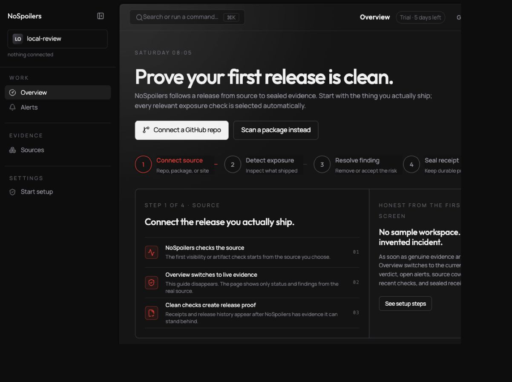
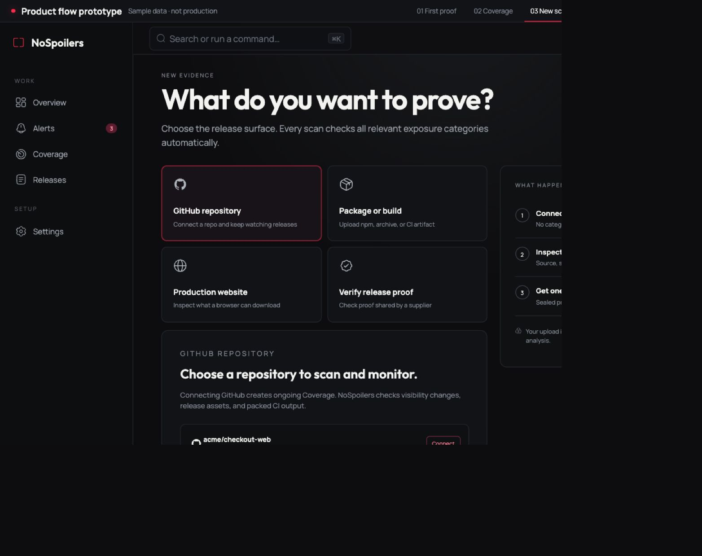
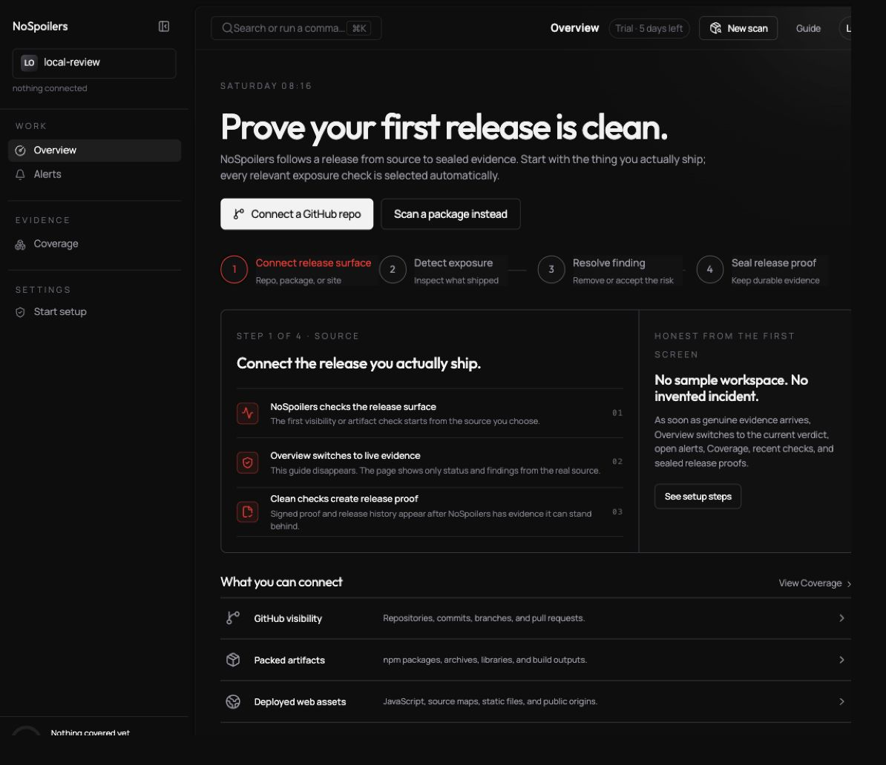
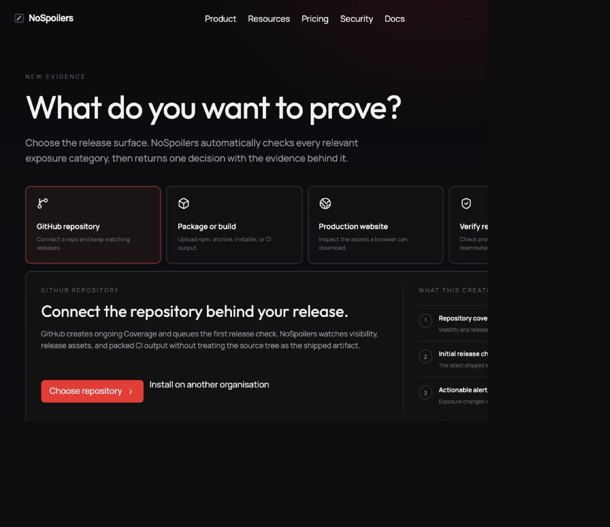

# NoSpoilers production flow audit and build plan

Reviewed: 5 September 2026

This audit compares the live local product with the master-flow prototype and the V20 homepage preview. The prototype is visual and interactive sample data; only production screens are API-backed.

## Executive decision

The product should use one small navigation spine:

**Overview · Alerts · Coverage · Releases · Settings**

**New Scan is a global action, not a sidebar destination.** It also appears contextually in Overview, Coverage, and Releases.

The V20 homepage preview is useful and should stay. Its compact release header, finding-category tabs, concise evidence rows, Rescan action, and animated release-boundary story are strong. The old preview navigation was not useful because Watch, Packages, Deployments, and Reports overlapped. Those labels are now consolidated into the product model above.

## Core object model

- **Coverage** answers: “What are we continuously watching?” It is the persistent inventory of GitHub repositories, registry packages, production origins, and private map-custody destinations, including health, permissions, cadence, and most recent evidence.
- **Releases** answer: “What did this exact version prove?” They are immutable or historical scan outcomes with artifact digest, commit/version, environment, verdict, findings, approvals, remediation, and signed proof.
- **Alerts** answer: “What exposure change needs a human response?” Alerts are actionable findings across Coverage and have Open, In progress, or Resolved status. Assignment is a separate filter.
- **New Scan** answers: “What do you want to prove now?” It is a launcher, not stored inventory.

Object creation rules:

1. GitHub connection creates ongoing Coverage and queues the initial Release check.
2. Package/build upload creates a one-off Release; it only becomes Coverage when the customer links a registry or explicitly enables monitoring.
3. A production website becomes Coverage after ownership verification, then each completed check creates release evidence.
4. Release-proof verification is free because it verifies an already-issued signature and artifact hash; it does not run a new hosted scan.

## Journey health

1. **Marketing preview — healthy.** It communicates the problem and result well. Its navigation has now been aligned with the real application. Preserve the category tabs, evidence list, release metadata, Rescan action, and supply-chain animation.
2. **Public New Scan — improved, partially complete.** GitHub is now a first-class choice beside package, website, and proof verification. Package staging and website ownership gating already exist. Remaining work is to move the complete authenticated experience into the application shell after login instead of leaving the user in a public-page frame.
3. **Authentication and trial — healthy direction, needs lifecycle QA.** There is no trial-preview tenant. A real login starts the five-day trial. The pending-scan claim, expiry, cross-browser protection, billing transition, and expired-trial messaging still need an end-to-end matrix.
4. **First Proof — healthy.** The honest four-step empty state is the correct first authenticated screen and contains no invented customer data.
5. **Coverage — improved, partially complete.** Customer-facing language now matches the object. The production route remains `/watch/sources` for compatibility. Connection, permission, disconnected, stale, and ownership-verification states require full API-backed completion.
6. **Releases — strong foundation.** The index/master-detail selection and full Release Readiness brief are the right split. State variants and proof-sharing behavior require completion.
7. **Alerts — strong prototype, partially integrated.** The prototype’s queue/detail workspace and independent assignment filter are the correct direction. Real actions, permissions, routing integrations, pagination, and audit history need production completion.
8. **Enterprise administration — incomplete.** Policy, approvals, exceptions, team roles, audit export, retention, installation health, API tokens, registries, and integrations exist in pieces but need one coherent Settings hierarchy and state matrix.

## Evidence from this review

### Previous broad grey stage

The content stage used a large grey plate that competed with the cards and made the workspace feel flatter and heavier than the prototype.

### GitHub added to the master-flow New Scan prototype

The four choices now describe user-owned release surfaces rather than internal detection categories. The GitHub repository rows are interactive and hand off to Coverage.

### Production Overview after spotlight revision

The main stage is now near-black with a restrained top-right highlight. The rail and gutter remain black, preserving depth without turning the whole content area grey.

### Production GitHub scan entry

Production now exposes GitHub alongside package/build, website, and proof verification. A signed-in customer is handed to the real GitHub coverage configuration route.

## What has been implemented in this pass

- Added GitHub repository to the prototype and production New Scan launchers.
- Wired prototype repository selection into Coverage.
- Added a global New Scan action to the authenticated product header.
- Renamed the customer-facing Sources area to Coverage while retaining the stable `/watch/sources` route.
- Clarified Coverage versus one-off scan behavior in empty states and supporting copy.
- Updated First Proof terminology from receipt/source ambiguity to release proof and release surface.
- Replaced the broad grey Watch stage with a compact top-right spotlight.
- Reconciled the V20 homepage preview navigation with the real product model.
- Rephrased free verification so it cannot be mistaken for free hosted scanning.

## Missing production work

### Core workflows

- Complete the authenticated New Scan shell handoff so GitHub, package, website, and proof flows retain the product navigation and state.
- Build the real GitHub repository picker, installation selector, permission handling, empty organisation state, and initial scan progress.
- Finish Coverage detail/configuration for repository, registry package, production website, and private map custody.
- Complete Releases state variants: queued, checking, clean, blocked, inconclusive, waiting for approval, approved exception, superseded, and scan failure.
- Complete Release Detail operations: recheck, proof download/share, acknowledgement, policy exception, approval, revoke/expire, and history.
- Integrate the Alerts prototype with real APIs: queue selection, acknowledge, assignment, resolution note, reopen, response history, and related release/coverage navigation.
- Build the populated Daily Overview with current release decision, next best action, open risk, coverage health, recent checks, and recent proofs.
- Add Timeline/activity as a view within Overview or each object rather than necessarily adding another permanent sidebar item.

### Enterprise control plane

- Settings index with clear sections for workspace, notifications/integrations, policies, people/access, evidence/retention, and developer/API configuration.
- Slack, Microsoft Teams, email, Jira/Linear, PagerDuty, webhook, and SIEM routing with test-send and delivery-health states.
- SSO/SAML, SCIM, role design, invitations, service accounts, and least-privilege permission descriptions.
- Policy rules, allowlists, baselines, time-bound exceptions, approval chains, reason capture, expiry, and separation of duties.
- Audit log, export jobs, evidence retention, legal hold, regional/data-residency controls, and deletion workflows.
- GitHub App installation health, webhook freshness, private registry credentials, token lifecycle, CLI setup, and CI status checks.
- Billing owners, plan/usage display, five-day trial lifecycle, upgrade, expired coverage, cancellation, and grace states.

### Cross-product state matrix

- Loading, empty, partial data, stale, disconnected, permission denied, not found, rate limited, service unavailable, retry, and offline states.
- Responsive desktop/tablet/mobile layouts, keyboard navigation, focus return for dialogs/drawers, reduced motion, and zoom to 200%.
- Text labels in addition to colour for severity/verdict, accessible live announcements for scan progress, and error summaries that point to the failing control.
- Destructive-action confirmation, unsaved-change protection, optimistic-action rollback, duplicate submission protection, and idempotent scan creation.
- Performance budgets for large alert/release lists, virtualisation or pagination, route-level code splitting, and telemetry for failed handoffs.
- Security validation for tenancy, object-level authorization, signed proof verification, upload quarantine, SSRF/ownership protection, expiry, and abuse controls.

## Build order

1. **Lock the product language and shell.** Finish global navigation, New Scan handoff, visual tokens, and shared decision/evidence components.
2. **Finish the revenue-critical proof loop.** GitHub/package/site input → authentication/trial → scan progress → Release Detail → remediation/recheck → signed proof.
3. **Finish the persistent model.** Coverage configuration/health and Releases history/state variants.
4. **Operationalize response.** Production Alerts, assignment/routing, activity, and the populated Daily Overview.
5. **Add enterprise governance.** Roles, policy, approvals, audit, integrations, retention, and installation health.
6. **Harden every state.** Accessibility, responsive behavior, security, performance, failure recovery, and lifecycle QA.

## Accessibility and usability notes

Strengths: core controls are native buttons/links, scan modes expose selected state, headings are structured, severity has text, and the red accent is not the only carrier of meaning.

Risks: the standalone prototype is not production accessibility evidence; it still needs full keyboard and focus testing. Long labels and the four-choice launcher need verification at narrow widths and browser zoom. Scan status changes need a deliberate live region. Dialog and drawer actions need focus restoration. The app must not use low-contrast muted text for essential instructions.

## Evidence limits

This review inspected the local desktop experience, existing source, and current prototype. The prototype uses sample data and is not API-backed. The production GitHub App cannot be validated against a real external organisation without its OAuth environment and a test installation. Mobile, 200% zoom, screen reader behavior, full billing, and every backend failure branch were not exhaustively exercised in this pass.

## Definition of done

The build is ready when every visible control is connected to a real route or API, no authenticated customer screen invents data, all core state variants are tested, accessibility and responsive checks pass, authorization and abuse protections are verified, and the marketing preview accurately represents—not replaces—the production application.
